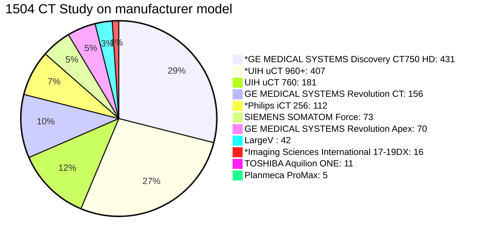
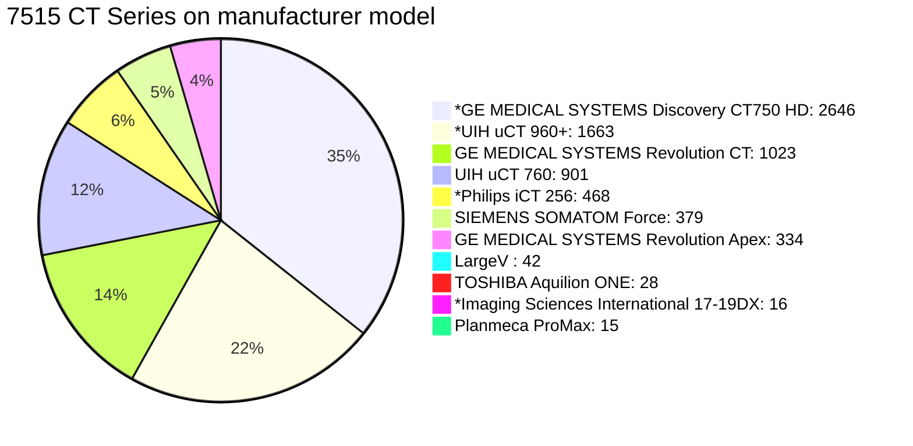
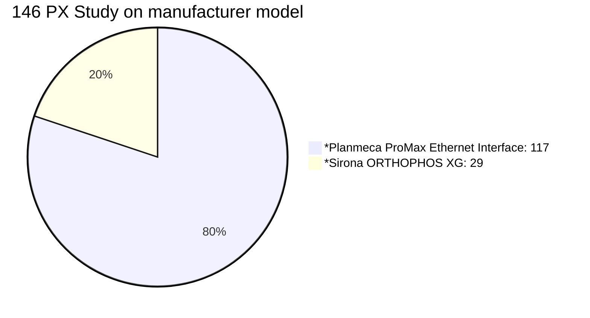
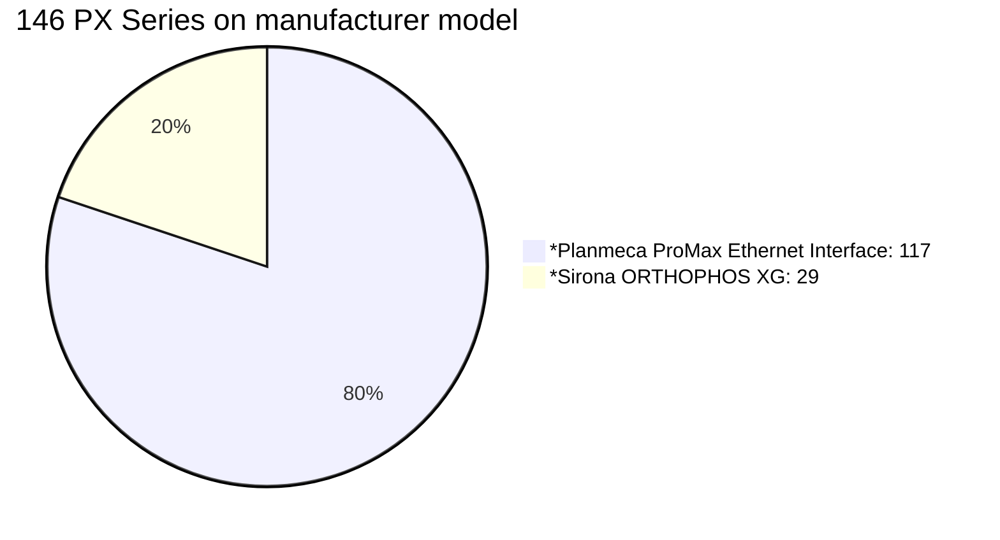
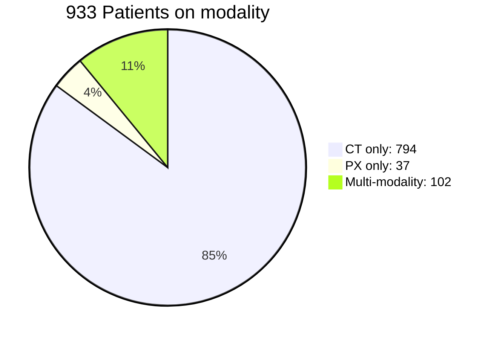

```mermaid
pie title 1504 CT Study on manufacturer model
    "*GE MEDICAL SYSTEMS Discovery CT750 HD: 431" : 431
    "*UIH uCT 960+: 407" : 407
    "UIH uCT 760: 181" : 181
    "GE MEDICAL SYSTEMS Revolution CT: 156" : 156
    "*Philips iCT 256: 112" : 112
    "SIEMENS SOMATOM Force: 73" : 73
    "GE MEDICAL SYSTEMS Revolution Apex: 70" : 70
    "LargeV : 42" : 42
    "*Imaging Sciences International 17-19DX: 16" : 16
    "TOSHIBA Aquilion ONE: 11" : 11
    "Planmeca ProMax: 5" : 5
```

 > \*: specified manufacturer model

```mermaid
pie title 7515 CT Series on manufacturer model
    "*GE MEDICAL SYSTEMS Discovery CT750 HD: 2646" : 2646
    "*UIH uCT 960+: 1663" : 1663
    "GE MEDICAL SYSTEMS Revolution CT: 1023" : 1023
    "UIH uCT 760: 901" : 901
    "*Philips iCT 256: 468" : 468
    "SIEMENS SOMATOM Force: 379" : 379
    "GE MEDICAL SYSTEMS Revolution Apex: 334" : 334
    "LargeV : 42" : 42
    "TOSHIBA Aquilion ONE: 28" : 28
    "*Imaging Sciences International 17-19DX: 16" : 16
    "Planmeca ProMax: 15" : 15
```

 > \*: specified manufacturer model

```mermaid
pie title 146 PX Study on manufacturer model
    "*Planmeca ProMax Ethernet Interface: 117" : 117
    "*Sirona ORTHOPHOS XG: 29" : 29
```

 > \*: specified manufacturer model

```mermaid
pie title 146 PX Series on manufacturer model
    "*Planmeca ProMax Ethernet Interface: 117" : 117
    "*Sirona ORTHOPHOS XG: 29" : 29
```

 > \*: specified manufacturer model

```mermaid
pie title 933 Patients on modality
    "CT only: 794": 794
    "PX only: 37": 37
    "Multi-modality: 102": 102
```