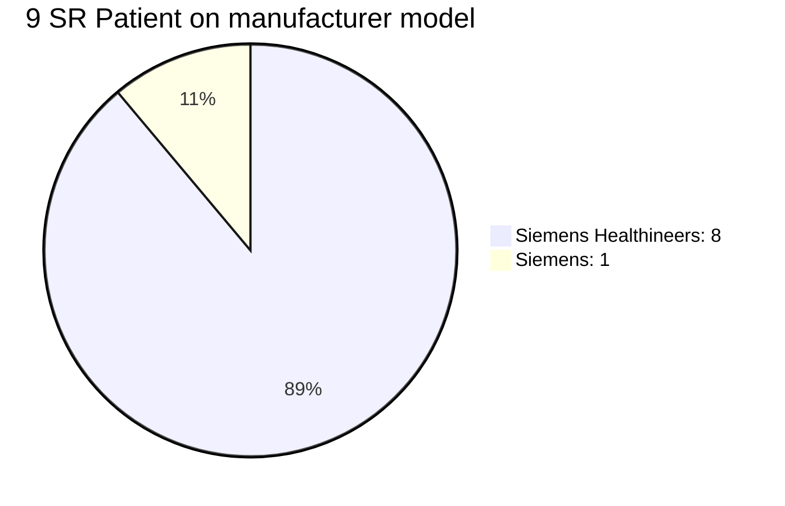

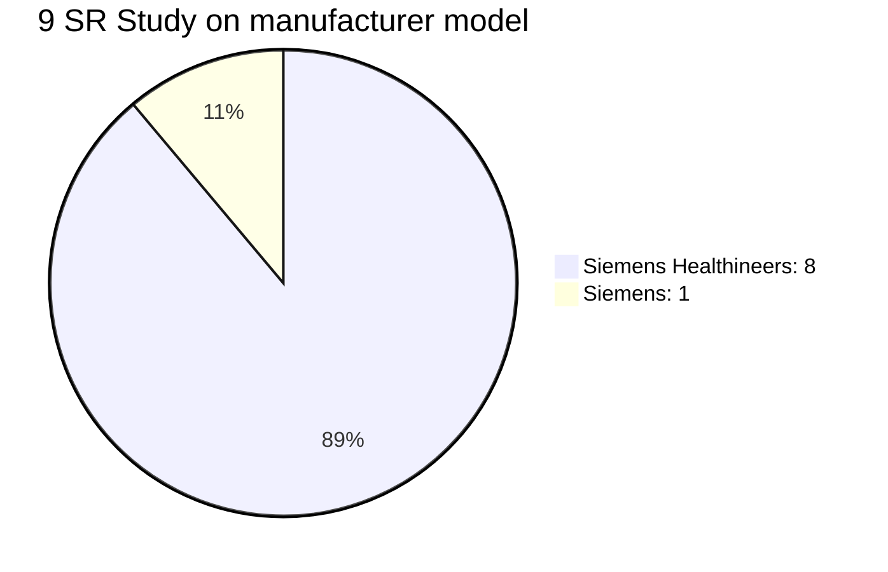


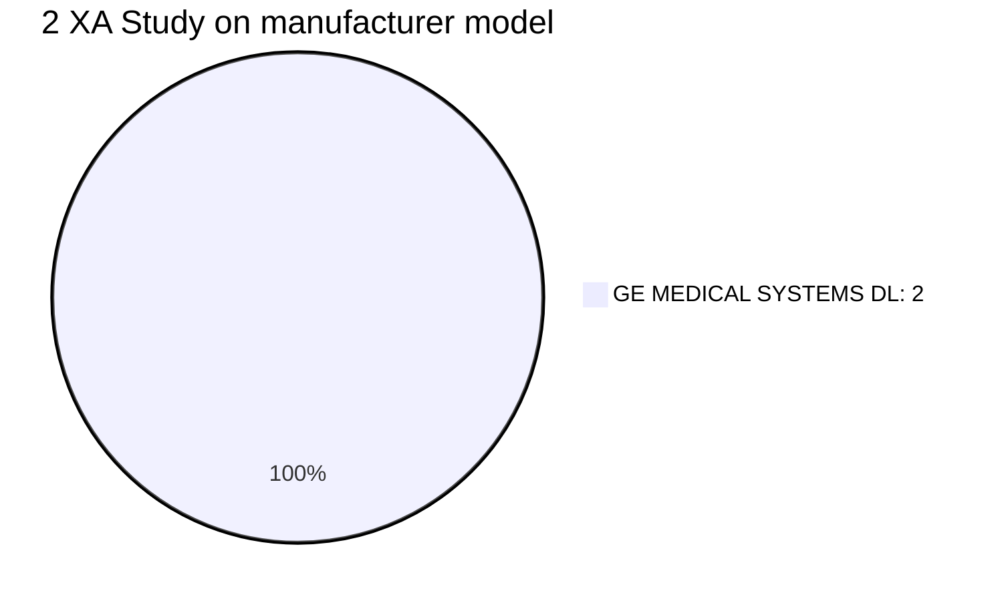


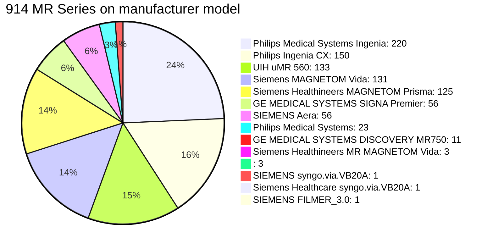


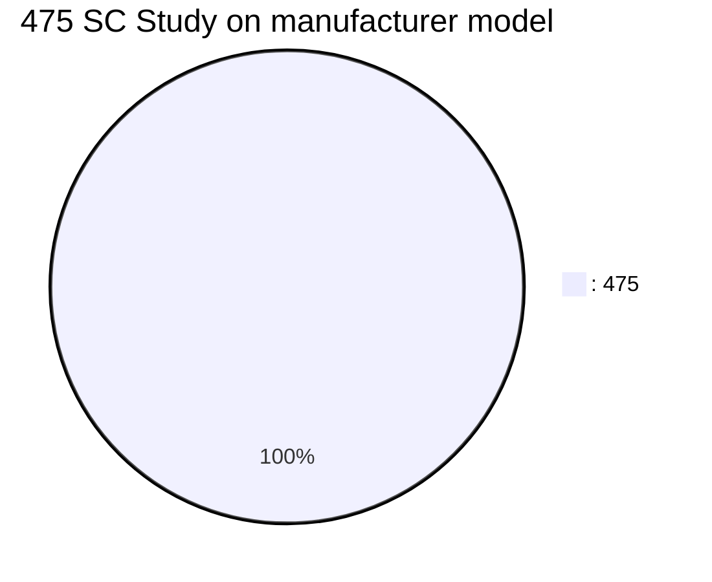

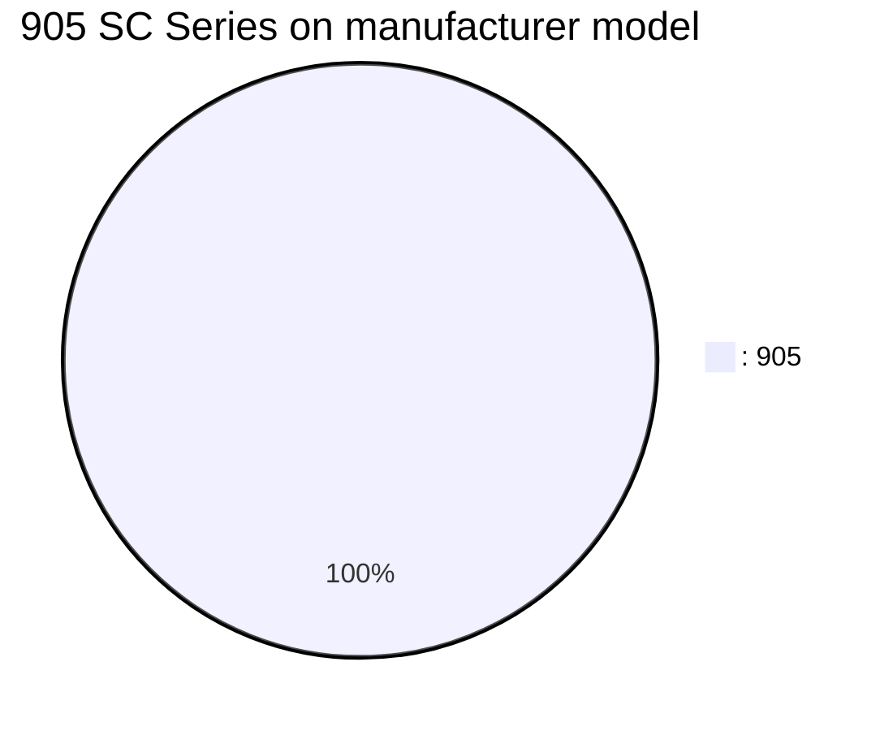


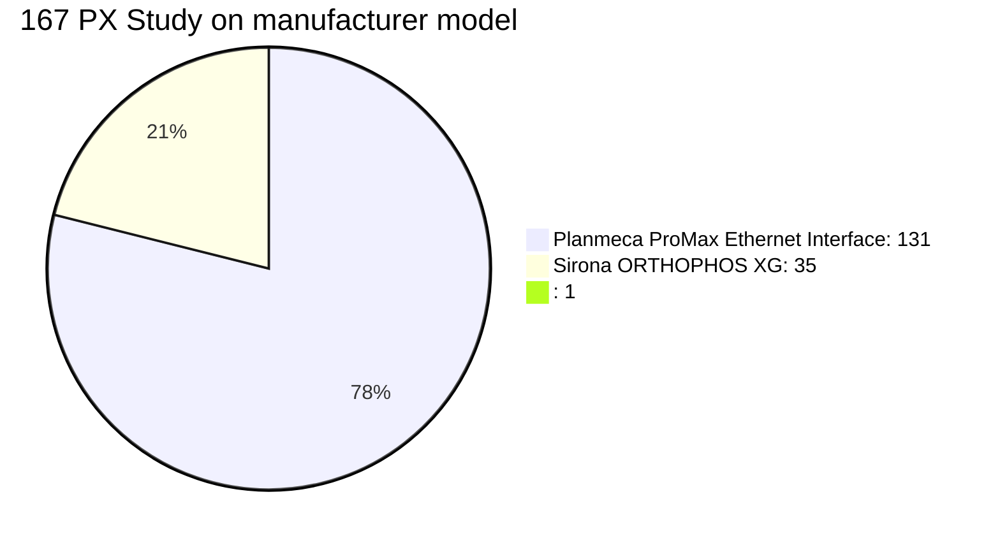

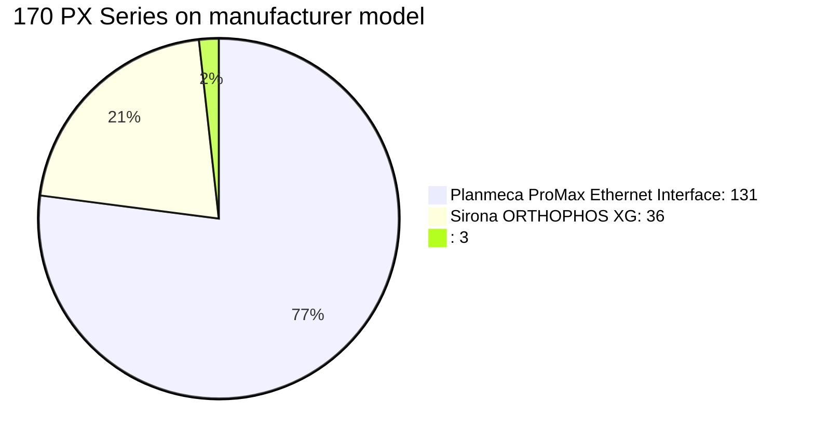

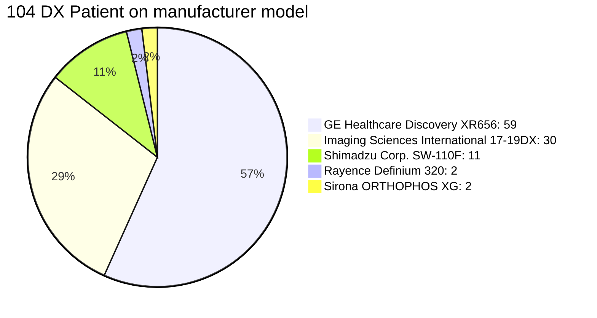


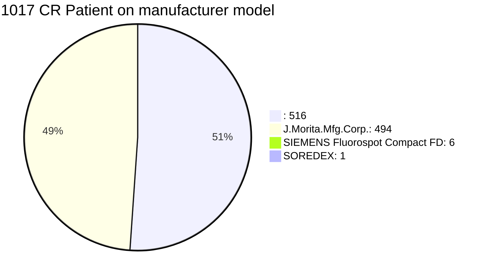

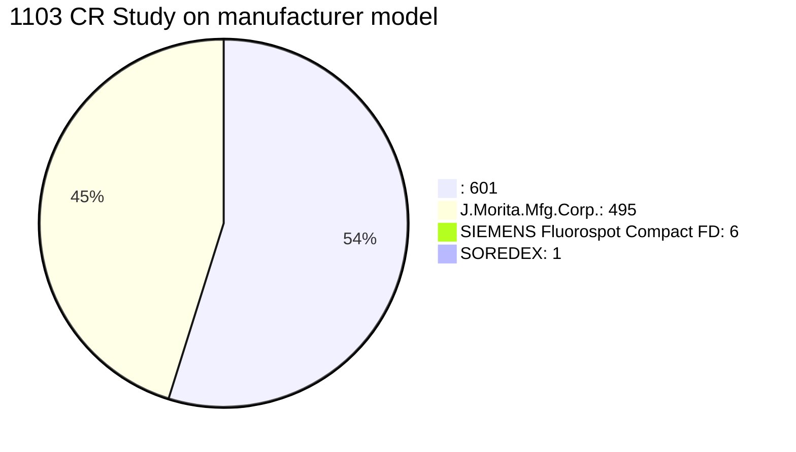

```mermaid
pie title 1503 CR Series on manufacturer model
    ": 962" : 962
    "J.Morita.Mfg.Corp.: 533" : 533
    "SIEMENS Fluorospot Compact FD: 7" : 7
    "SOREDEX: 1" : 1
```

```mermaid
pie title 11 IO Patient on manufacturer model
    "SOREDEX: 11" : 11
```

```mermaid
pie title 11 IO Study on manufacturer model
    "SOREDEX: 11" : 11
```

```mermaid
pie title 27 IO Series on manufacturer model
    "SOREDEX: 27" : 27
```

```mermaid
pie title 2345 CT Patient on manufacturer model
    "UIH uCT 960+: 587" : 587
    "GE MEDICAL SYSTEMS Discovery CT750 HD: 525" : 525
    "Philips iCT 256: 323" : 323
    "GE MEDICAL SYSTEMS Revolution CT: 216" : 216
    "UIH uCT 760: 158" : 158
    "uCT 760: 143" : 143
    "Shukun Shukun AI: 112" : 112
    "GE MEDICAL SYSTEMS Revolution Apex: 85" : 85
    "SIEMENS SOMATOM Force: 70" : 70
    "LargeV: 68" : 68
    "Imaging Sciences International 17-19DX: 31" : 31
    "TOSHIBA Aquilion ONE: 12" : 12
    "Planmeca ProMax: 5" : 5
    "GE Healthcare Revolution CT: 4" : 4
    "UIH: 3" : 3
    "Shukun Revolution CT: 1" : 1
    "Philips: 1" : 1
    "Philips IntelliSpace Portal: 1" : 1
```

```mermaid
pie title 2579 CT Study on manufacturer model
    "UIH uCT 960+: 614" : 614
    "GE MEDICAL SYSTEMS Discovery CT750 HD: 534" : 534
    "Philips iCT 256: 383" : 383
    "GE MEDICAL SYSTEMS Revolution CT: 219" : 219
    "UIH uCT 760: 210" : 210
    "uCT 760: 186" : 186
    "Shukun Shukun AI: 115" : 115
    "SIEMENS SOMATOM Force: 92" : 92
    "GE MEDICAL SYSTEMS Revolution Apex: 91" : 91
    "LargeV: 76" : 76
    "Imaging Sciences International 17-19DX: 31" : 31
    "TOSHIBA Aquilion ONE: 12" : 12
    "Planmeca ProMax: 5" : 5
    "GE Healthcare Revolution CT: 4" : 4
    "UIH: 3" : 3
    "Philips: 2" : 2
    "Shukun Revolution CT: 1" : 1
    "Philips IntelliSpace Portal: 1" : 1
```

```mermaid
pie title 15013 CT Series on manufacturer model
    "GE MEDICAL SYSTEMS Discovery CT750 HD: 4002" : 4002
    "UIH uCT 960+: 2526" : 2526
    "Philips iCT 256: 2145" : 2145
    "Shukun Shukun AI: 1976" : 1976
    "GE MEDICAL SYSTEMS Revolution CT: 1789" : 1789
    "UIH uCT 760: 1049" : 1049
    "SIEMENS SOMATOM Force: 563" : 563
    "GE MEDICAL SYSTEMS Revolution Apex: 552" : 552
    "uCT 760: 201" : 201
    "LargeV: 76" : 76
    "TOSHIBA Aquilion ONE: 61" : 61
    "Imaging Sciences International 17-19DX: 32" : 32
    "Shukun Revolution CT: 16" : 16
    "Planmeca ProMax: 15" : 15
    "GE Healthcare Revolution CT: 4" : 4
    "UIH: 3" : 3
    "Philips: 2" : 2
    "Philips IntelliSpace Portal: 1" : 1
```