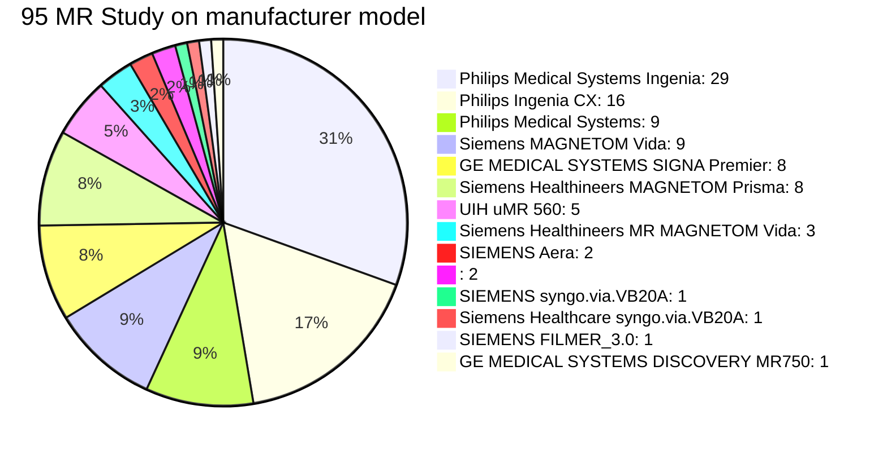

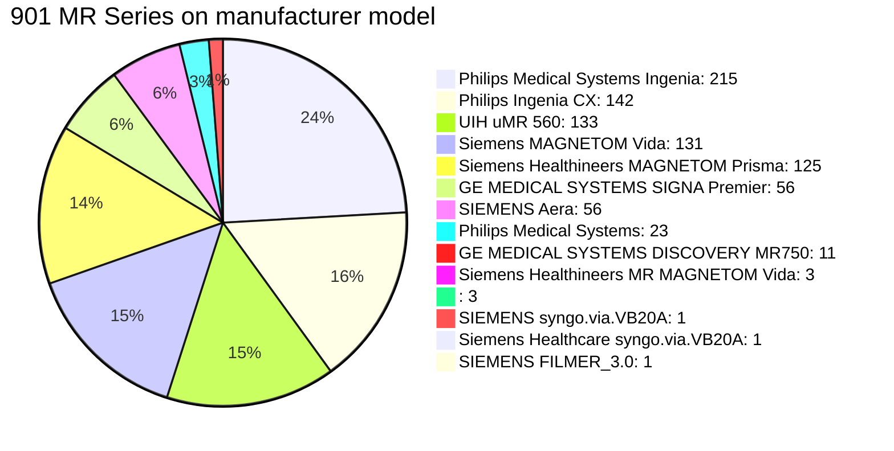

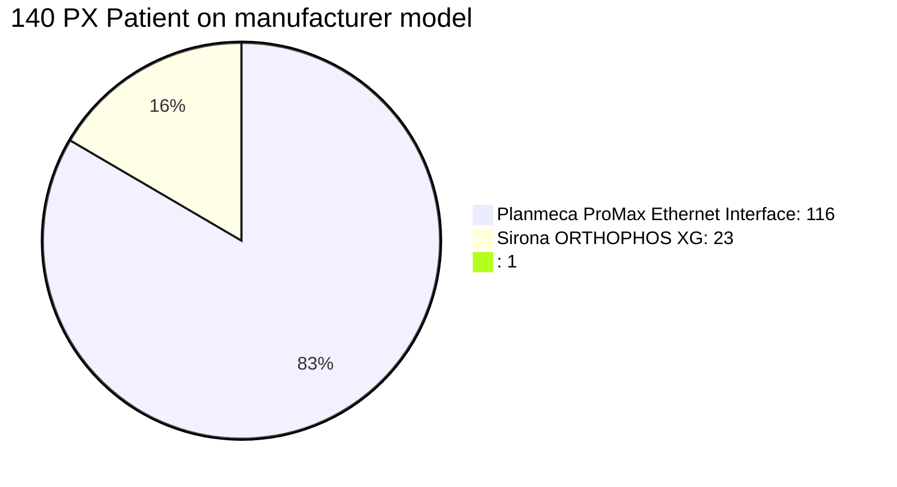

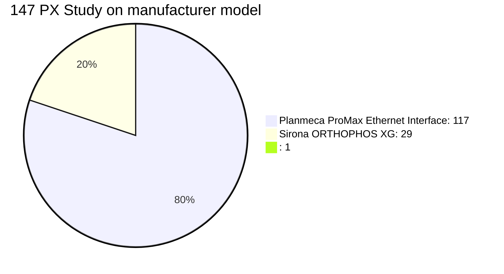

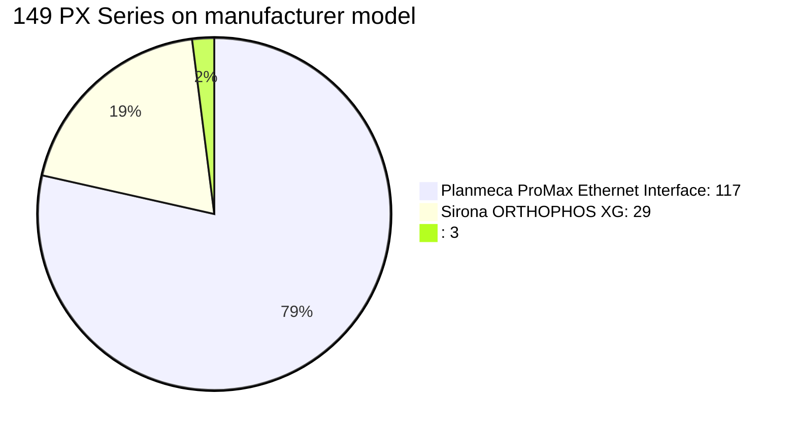

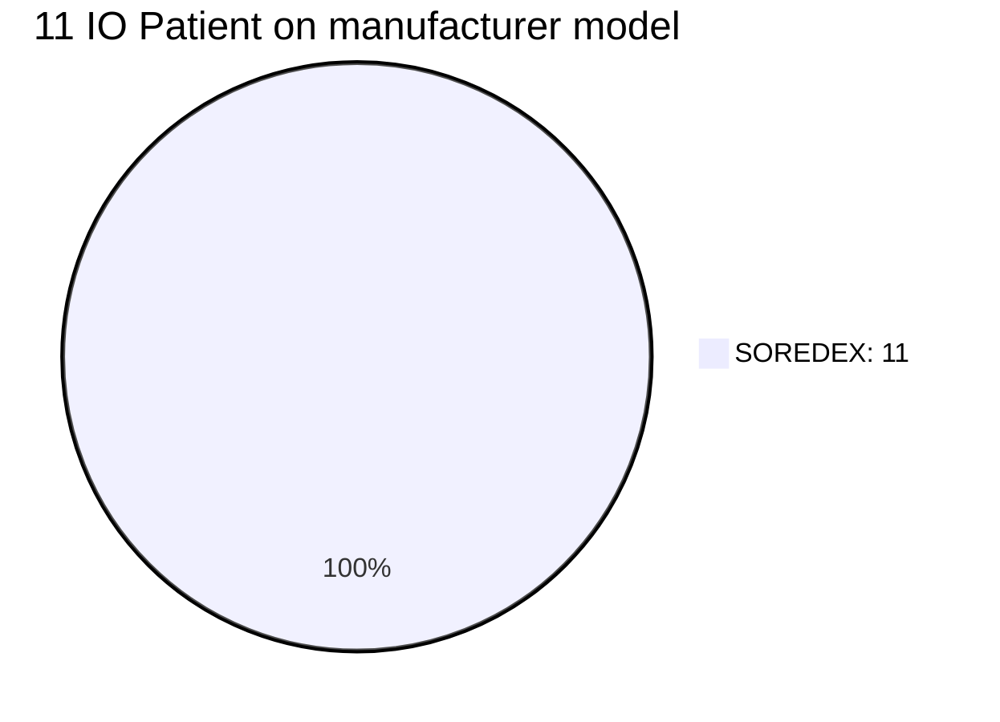


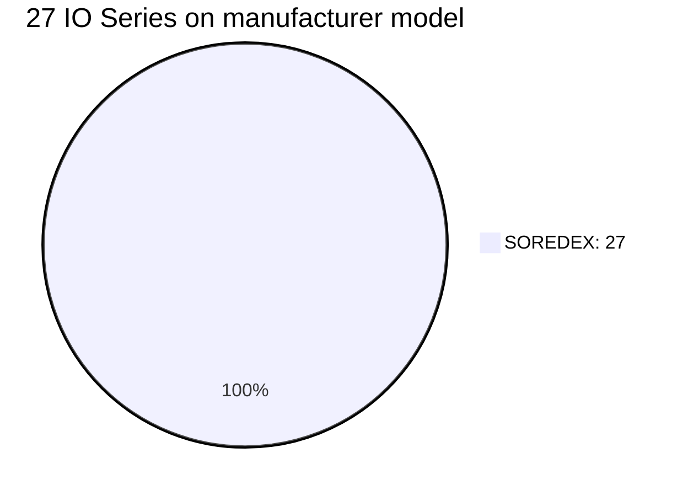


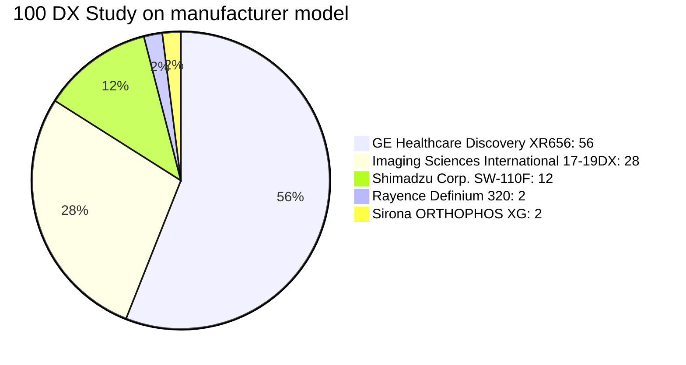

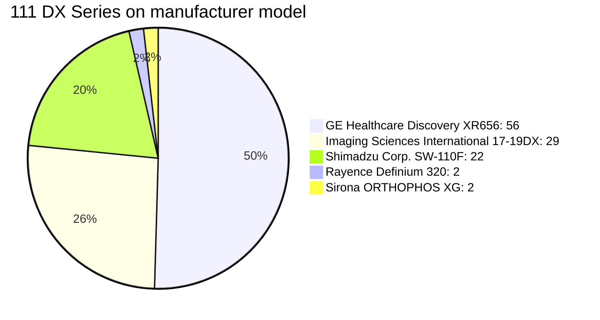

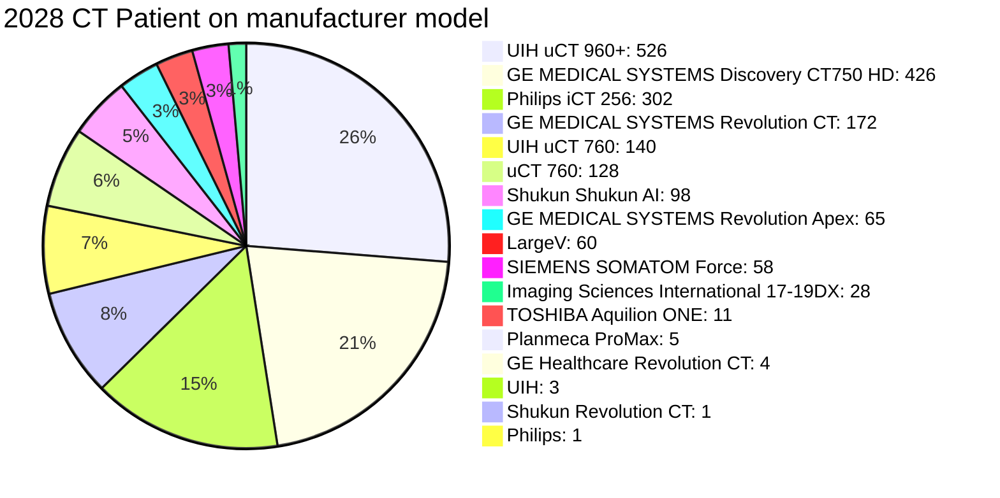

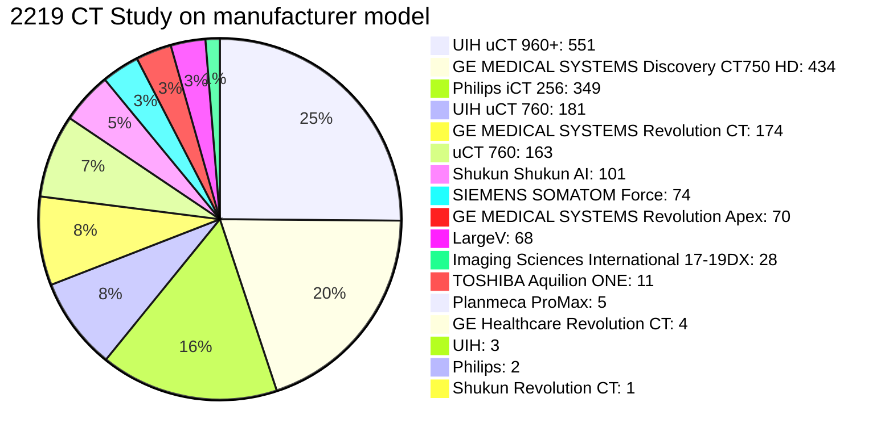

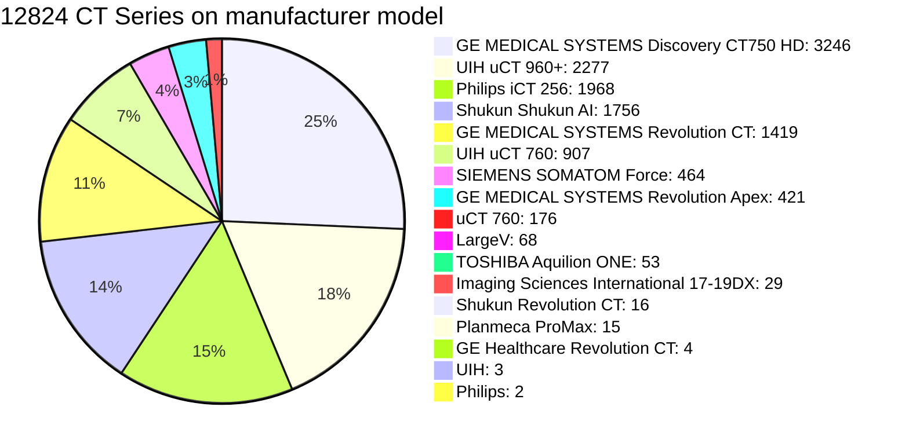


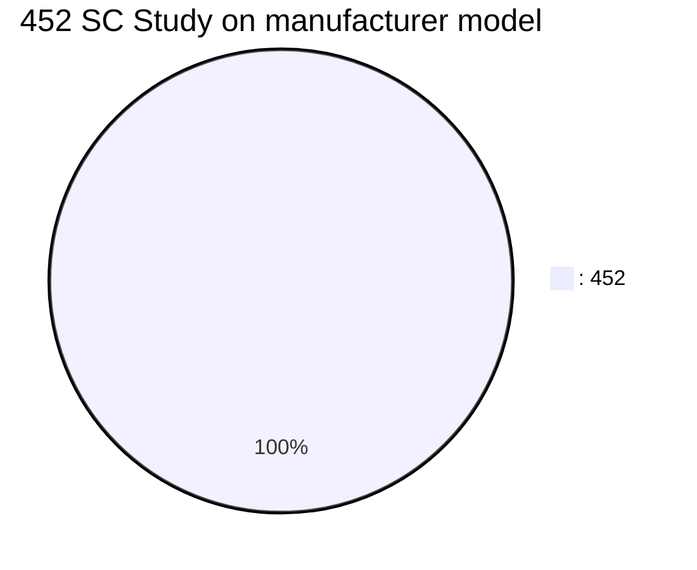


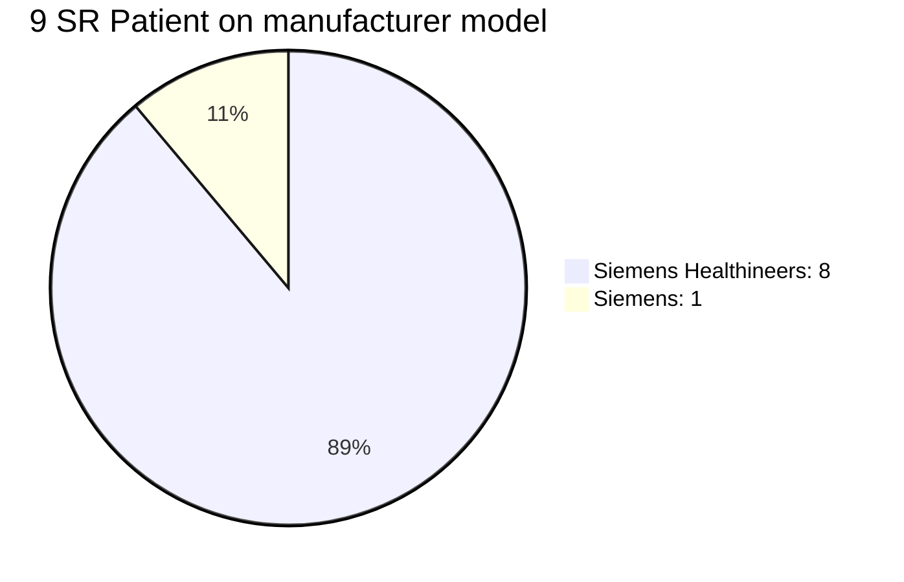

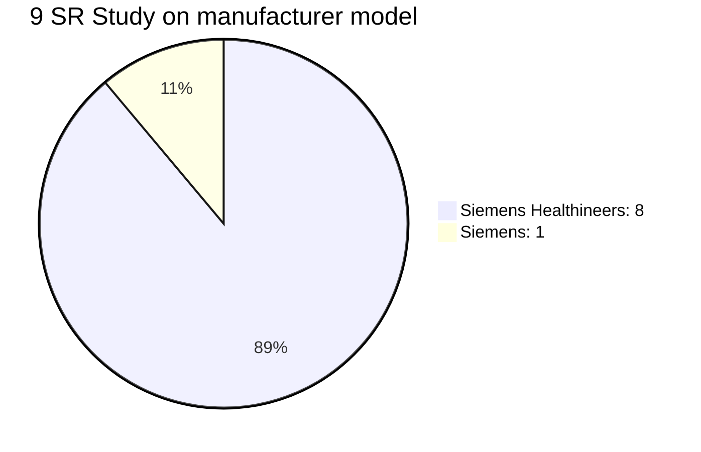

```mermaid
pie title 9 SR Series on manufacturer model
    "Siemens Healthineers: 8" : 8
    "Siemens: 1" : 1
```

```mermaid
pie title 2 XA Patient on manufacturer model
    "GE MEDICAL SYSTEMS DL: 2" : 2
```

```mermaid
pie title 2 XA Study on manufacturer model
    "GE MEDICAL SYSTEMS DL: 2" : 2
```

```mermaid
pie title 5 XA Series on manufacturer model
    "GE MEDICAL SYSTEMS DL: 5" : 5
```

```mermaid
pie title 481 CR Patient on manufacturer model
    ": 477" : 477
    "SIEMENS Fluorospot Compact FD: 3" : 3
    "SOREDEX: 1" : 1
```

```mermaid
pie title 565 CR Study on manufacturer model
    ": 561" : 561
    "SIEMENS Fluorospot Compact FD: 3" : 3
    "SOREDEX: 1" : 1
```

```mermaid
pie title 915 CR Series on manufacturer model
    ": 910" : 910
    "SIEMENS Fluorospot Compact FD: 4" : 4
    "SOREDEX: 1" : 1
```