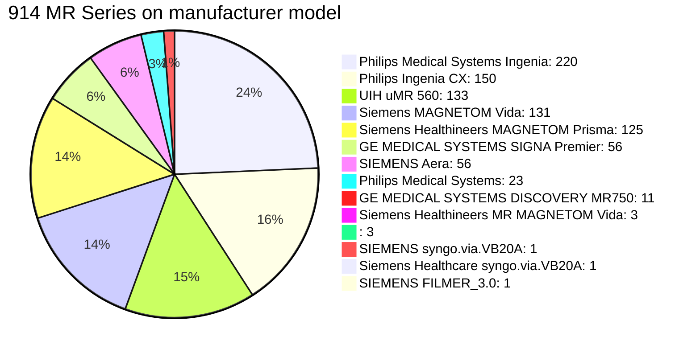


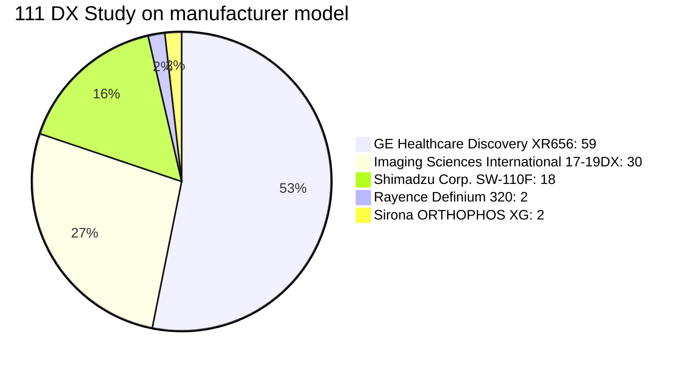

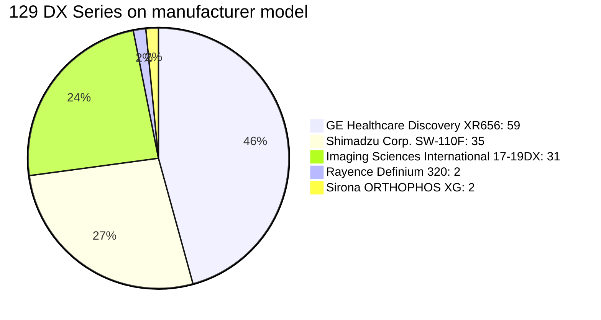


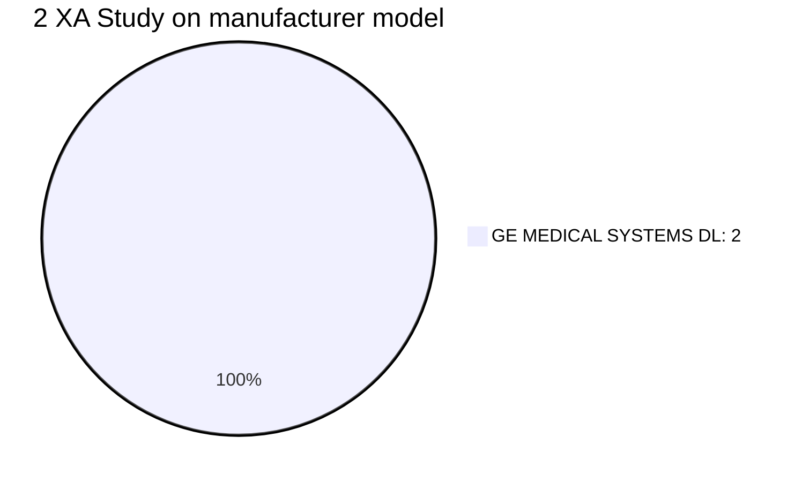


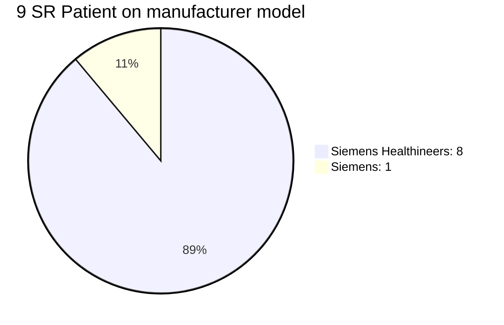

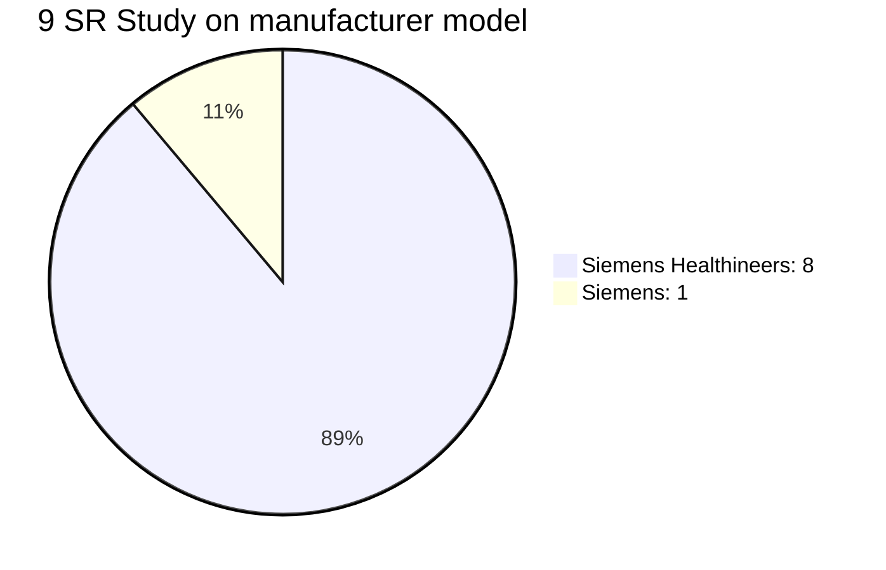


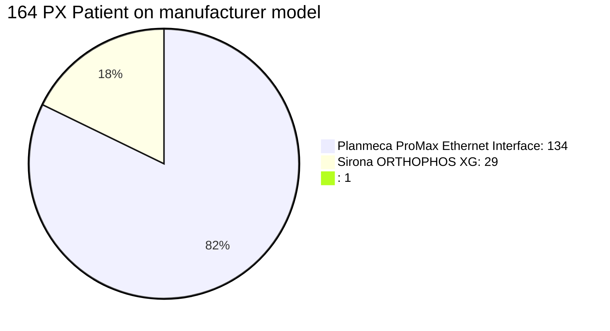

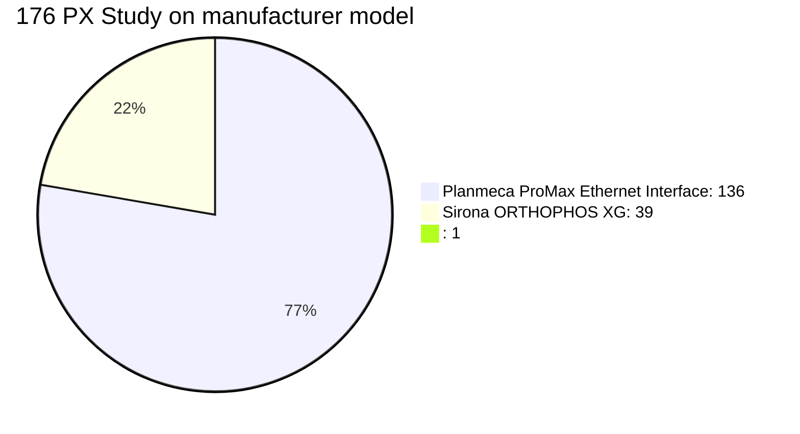

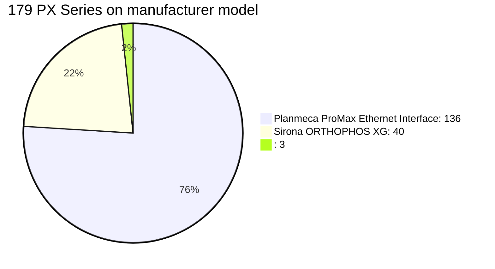

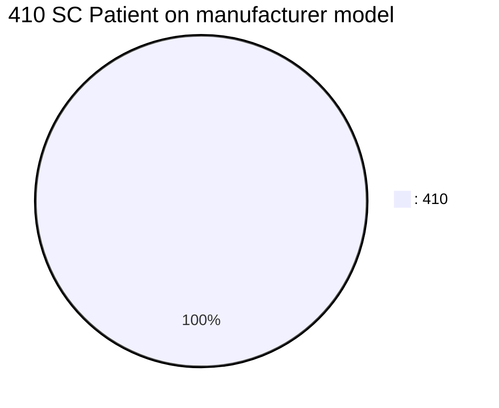


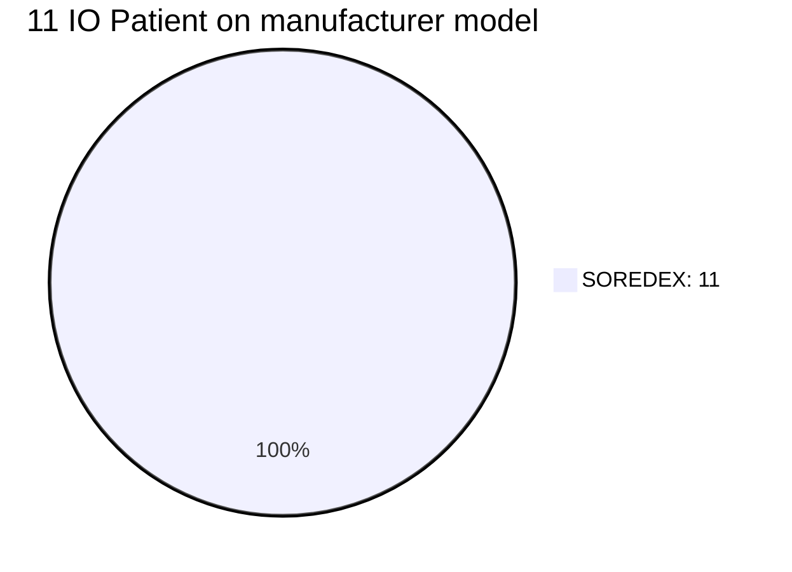


```mermaid
pie title 27 IO Series on manufacturer model
    "SOREDEX: 27" : 27
```

```mermaid
pie title 2464 CT Patient on manufacturer model
    "UIH uCT 960+: 612" : 612
    "GE MEDICAL SYSTEMS Discovery CT750 HD: 577" : 577
    "Philips iCT 256: 323" : 323
    "GE MEDICAL SYSTEMS Revolution CT: 228" : 228
    "UIH uCT 760: 164" : 164
    "uCT 760: 150" : 150
    "Shukun Shukun AI: 118" : 118
    "GE MEDICAL SYSTEMS Revolution Apex: 87" : 87
    "SIEMENS SOMATOM Force: 78" : 78
    "LargeV: 68" : 68
    "Imaging Sciences International 17-19DX: 31" : 31
    "TOSHIBA Aquilion ONE: 13" : 13
    "Planmeca ProMax: 5" : 5
    "GE Healthcare Revolution CT: 4" : 4
    "UIH: 3" : 3
    "Shukun Revolution CT: 1" : 1
    "Philips: 1" : 1
    "Philips IntelliSpace Portal: 1" : 1
```

```mermaid
pie title 2706 CT Study on manufacturer model
    "UIH uCT 960+: 640" : 640
    "GE MEDICAL SYSTEMS Discovery CT750 HD: 586" : 586
    "Philips iCT 256: 383" : 383
    "GE MEDICAL SYSTEMS Revolution CT: 232" : 232
    "UIH uCT 760: 219" : 219
    "uCT 760: 195" : 195
    "Shukun Shukun AI: 122" : 122
    "SIEMENS SOMATOM Force: 100" : 100
    "GE MEDICAL SYSTEMS Revolution Apex: 93" : 93
    "LargeV: 76" : 76
    "Imaging Sciences International 17-19DX: 31" : 31
    "TOSHIBA Aquilion ONE: 13" : 13
    "Planmeca ProMax: 5" : 5
    "GE Healthcare Revolution CT: 4" : 4
    "UIH: 3" : 3
    "Philips: 2" : 2
    "Shukun Revolution CT: 1" : 1
    "Philips IntelliSpace Portal: 1" : 1
```

```mermaid
pie title 15848 CT Series on manufacturer model
    "GE MEDICAL SYSTEMS Discovery CT750 HD: 4388" : 4388
    "UIH uCT 960+: 2630" : 2630
    "Philips iCT 256: 2145" : 2145
    "Shukun Shukun AI: 2088" : 2088
    "GE MEDICAL SYSTEMS Revolution CT: 1903" : 1903
    "UIH uCT 760: 1096" : 1096
    "SIEMENS SOMATOM Force: 611" : 611
    "GE MEDICAL SYSTEMS Revolution Apex: 562" : 562
    "uCT 760: 211" : 211
    "LargeV: 76" : 76
    "TOSHIBA Aquilion ONE: 65" : 65
    "Imaging Sciences International 17-19DX: 32" : 32
    "Shukun Revolution CT: 16" : 16
    "Planmeca ProMax: 15" : 15
    "GE Healthcare Revolution CT: 4" : 4
    "UIH: 3" : 3
    "Philips: 2" : 2
    "Philips IntelliSpace Portal: 1" : 1
```

```mermaid
pie title 1025 CR Patient on manufacturer model
    ": 523" : 523
    "J.Morita.Mfg.Corp.: 494" : 494
    "SIEMENS Fluorospot Compact FD: 6" : 6
    "SOREDEX: 2" : 2
```

```mermaid
pie title 1111 CR Study on manufacturer model
    ": 608" : 608
    "J.Morita.Mfg.Corp.: 495" : 495
    "SIEMENS Fluorospot Compact FD: 6" : 6
    "SOREDEX: 2" : 2
```

```mermaid
pie title 1511 CR Series on manufacturer model
    ": 969" : 969
    "J.Morita.Mfg.Corp.: 533" : 533
    "SIEMENS Fluorospot Compact FD: 7" : 7
    "SOREDEX: 2" : 2
```